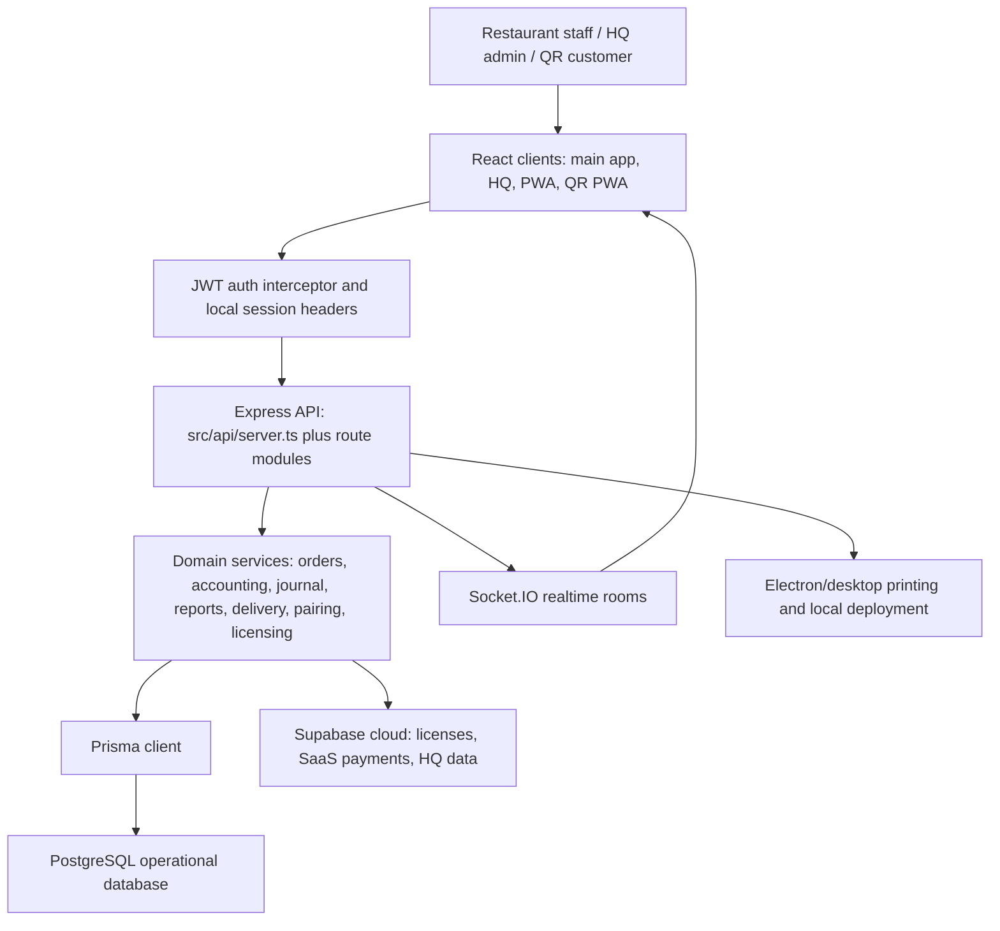
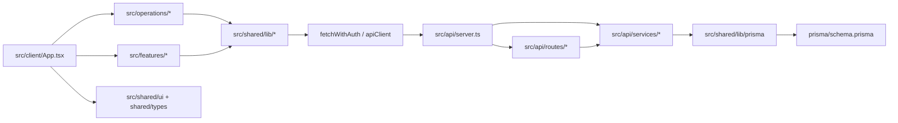

# FireFlow Architecture Audit

Audit date: 2026-06-25

## Architecture Diagram

## Dependency Map

## 1. Module Boundaries

FireFlow has recognizable modules, but boundaries are uneven.

Strong boundaries:
- Backend services: `src/api/services/orders/*`, `AccountingService.ts`, `JournalEntryService.ts`, report services, licensing, pairing, printer, QR services.
- Frontend domains: `src/operations/pos`, `src/operations/kds`, `src/operations/logistics`, `src/operations/finance`, `src/features/settings`, `src/features/saas-hq`.
- Shared layer: `src/shared/types.ts`, `src/shared/lib/*`, `src/shared/ui/*`.

Weak boundaries:
- `src/api/server.ts` contains core bootstrapping, middleware, licensing, auth, restaurants, staff, operations config, orders, analytics, menu, floor, system reset, pairing, audit logs, SaaS payment verification, generic table CRUD, server startup, and QR order logic.
- `src/client/App.tsx` is both app shell and data orchestration layer.
- Several route modules still contain business logic directly instead of delegating fully to services.

Verdict: modular enough to extract core gradually, not modular enough for a clean multi-product split today.

## 2. Database Schema Organization

`prisma/schema.prisma` contains 47 models and 11 enums. The schema is organized around a restaurant tenant root:

- Tenant root: `restaurants`
- People/security: `staff`, `registered_devices`, `pairing_codes`, `security_events`
- Restaurant operations: `orders`, `order_items`, `dine_in_orders`, `takeaway_orders`, `delivery_orders`, `reservation_orders`, `tables`, `sections`, `stations`
- Finance/accounting: `chart_of_accounts`, `journal_entries`, `journal_entry_lines`, `ledger_entries`, `transactions`, `expenses`, `payouts`, `cashier_sessions`, `cashier_shift_logs`
- Delivery: `rider_shifts`, `rider_settlements`, `delivery_orders`
- SaaS/HQ: `license_keys`, `subscription_payments`, `restaurant_features`
- Inventory/supply: `inventory_items`, `purchase_orders`, `purchase_order_items`, `recipe_items`, `suppliers`, `supplier_ledgers`

Strengths:
- Most operational entities include `restaurant_id`.
- Many uniqueness constraints are tenant-scoped, such as `customers @@unique([restaurant_id, phone])`, `tables @@unique([restaurant_id, name])`, `menu_categories @@unique([restaurant_id, name])`, `stations @@unique([restaurant_id, name])`.
- Order type extensions are modeled as 1:1 records, which is good for keeping common order logic separate from type-specific fields.

Risks:
- Some tenant fields are optional, especially older tables and compatibility surfaces.
- Some routes query by arbitrary query/body tenant input instead of deriving tenant from auth.
- `ledger_entries.account_id` is overloaded for staff/vendor/customer-like references, while `journal_entry_lines.account_id` points to `chart_of_accounts`; this split should be clarified before extraction.

## 3. Multi-Tenant Implementation

Implemented pattern:
- JWT claims include staff, role, and restaurant.
- `authMiddleware` attaches `req.staffId`, `req.restaurantId`, and `req.role`.
- Super admin can target another restaurant with `x-target-restaurant`.
- `sessionGateMiddleware` validates cashier session restaurant ownership.
- Most database entities are restaurant-scoped.

Gaps:
- Many inline `app.get/post/patch/delete` routes after the protected router do not use `authMiddleware`.
- Some endpoints take `restaurant_id` directly from `req.query` or `req.body`.
- Generic table endpoint applies auth, but accepts arbitrary filters and does not force `restaurant_id = req.restaurantId`.
- Public QR/menu routes are intentionally public, but need explicit signed table/restaurant scoping.

Verdict: tenant modeling is present, tenant enforcement is not yet reliable enough for a marketplace or multi-product platform.

## 4. API Structure

API surfaces include:
- Auth: `/api/auth/login`, `/api/auth/refresh`, `/api/auth/logout`, `/api/auth/verify-pin`
- Orders: `/api/orders`, `/api/orders/upsert`, `/api/orders/:id/settle`, workflow routes under `/api/orders`
- QR: `/api/orders/qr`, `/api/orders/qr-status/:orderId`, `/api/orders/qr-pending`, approval/reject routes
- Menu/categories/staff/tables/sections/customers/vendors/stations CRUD
- Accounting/cashier/finance/suppliers/reports/analytics route modules
- Delivery/rider workflow routes
- SaaS/HQ: super admin routes, subscription payments, licensing
- Device pairing routes
- Generic `/api/:table` table access for whitelisted tables

Strengths:
- Useful APIs already exist for core restaurant data.
- Several route modules are already separated and protected through `protectedApiRouter`.
- Swagger setup exists, but `openapi.json` appears to describe an older Supabase/PostgREST schema rather than the current Express API.

Risks:
- API documentation is not authoritative.
- Inline routes and route modules overlap.
- REST resources are not consistently versioned, authenticated, or validated.
- Marketplace-facing APIs should not reuse internal CRUD as-is.

## 5. Authentication and Authorization

Strengths:
- JWT access/refresh tokens exist.
- Token refresh is handled in `fetchWithAuth`.
- Role middleware exists via `requireRole`.
- Device pairing exists with rate limiting.
- Session gate exists for cashier-sensitive actions.

Risks:
- Login still performs plaintext PIN lookup and records `plaintext_fallback`.
- Staff model still stores `pin` alongside `hashed_pin`.
- `saved_pin` is stored in local storage for auto-login.
- Several management and data routes are unauthenticated.
- Role checks are not uniformly applied across equivalent operations.

## 6. Accounting Engine

Strengths:
- `AccountingService` and `JournalEntryService` provide a real double-entry direction.
- COA, journal entries, ledger entries, supplier/customer ledgers, expenses, cashier sessions, rider settlements, and reports are modeled.
- Idempotency guards exist for order revenue and rider liability.

Risks:
- Accounting service files are very large.
- There are two ledger concepts: general `ledger_entries` and COA `journal_entries`/`journal_entry_lines`.
- Some domain routes bypass service boundaries or may post financial effects directly.
- Test coverage is not configured in `package.json`.

Shared Core suitability: high, after clarifying ledger contracts and adding regression tests.

## 7. POS Engine

Strengths:
- Supports dine-in, takeaway, delivery, reservations, variants, bill calculations, settlement, active sessions, QR approval, mobile/desktop POS views.
- `BaseOrderService` has a reusable order-type strategy/factory.

Risks:
- `POSView.tsx` and `POSViewMobile.tsx` are large and tightly coupled to restaurant operations.
- Frontend uses direct state orchestration from `AppProvider`.
- Some billing logic exists both client-side and backend-side.

Shared Core suitability: backend order abstractions are reusable; FireFlow POS UI should remain FireFlow-specific.

## 8. KDS Implementation

Strengths:
- KDS is integrated through item statuses, stations, fire batches, Socket.IO events, and order workflow routes.
- Item status lifecycle is explicit in Prisma enums.
- Fire/recall batching exists.

Risks:
- Realtime events are emitted directly from services/routes.
- Some room/event naming issues should be reviewed before scaling. Example: recall emits to `restaurant:${latestBatch.order_id}` in `BaseOrderService`, which appears inconsistent with restaurant rooms.
- KDS is restaurant-specific and not a Shared Core candidate beyond generic workflow/event primitives.

## 9. Delivery System

Strengths:
- Delivery order records, rider assignment, rider shifts, settlements, location fields, delivery audit reports, and rider liability accounting exist.
- Delivery routes cover assign, delivered, failed, settle, deposit, pending settlement.

Risks:
- Delivery routes need systematic auth/role/tenant validation review.
- Marketplace delivery integration needs new order injection/status/event contracts.

Cravex suitability: moderate to high after API/event hardening.

## 10. SaaS/HQ Management

Strengths:
- Hybrid local/cloud architecture is documented.
- License keys, payment proof workflow, subscription guard, Super Admin view, HQ app files, cloud client, and notification hooks exist.

Risks:
- HQ/SaaS cloud schema appears split between Supabase and local Prisma.
- `openapi.json` reflects a Supabase/PostgREST schema and may not match current Express APIs.
- Super admin cross-tenant targeting needs stricter audit trails and scope control.

## FireFlow-Specific Components

- Dine-in floor/table management
- KDS station workflow
- Restaurant POS views
- Fire batches and kitchen recall semantics
- QR table ordering approval queue
- Restaurant receipt/FBR flows
- Fire Grill menu seed/data

## Shared Core Candidates

- Tenant context and auth middleware
- Role/permission primitives
- Prisma client and repository/service conventions
- Order base model, order type strategy interfaces, status enums
- Accounting/journal/ledger services
- Customer and supplier ledger services
- Reporting framework
- License/subscription guard primitives
- Device pairing primitives
- Shared UI controls and fetch/auth clients

## RetailFlow Candidates

- Tenant/accounting/customer/staff/supplier/inventory/reporting modules
- Auth, licensing, HQ, device management
- Generic order/payment/session concepts

## Cravex Marketplace Candidates

- Menu/catalog reads
- Restaurant profile and availability
- Customer/address reuse
- Order injection into FireFlow
- Delivery assignment/status
- Payment/settlement summaries
- QR/public ordering concepts as a starting point

## Risk Assessment

| Risk | Severity | Why it matters |
|---|---|---|
| Inconsistent auth and tenant enforcement | Critical | Blocks safe SaaS, marketplace, and multi-product operation. |
| Huge inline API server | High | Makes behavior hard to reason about and easy to regress. |
| Weak test/lint scripts | High | Refactoring toward Shared Core becomes risky. |
| Plaintext PIN compatibility | High | Security exposure for staff credentials. |
| Generic table API | High | Useful internally, dangerous as platform surface. |
| Product-specific UI coupling | Medium | Slows RetailFlow and Shared Core extraction. |

## Refactoring Recommendations

1. Freeze production behavior and add tests around orders, settlement, tenant isolation, auth, KDS status transitions, and delivery settlement.
2. Move all remaining inline routes from `src/api/server.ts` into route modules.
3. Add a tenant guard helper that forces tenant filters from `req.restaurantId`.
4. Replace generic table access with explicit service-backed APIs.
5. Extract service interfaces for order, customer, ledger, inventory, staff, reporting, and licensing.
6. Introduce an outbox/event table before Cravex integration.
7. Separate FireFlow UI from shared product UI primitives.

